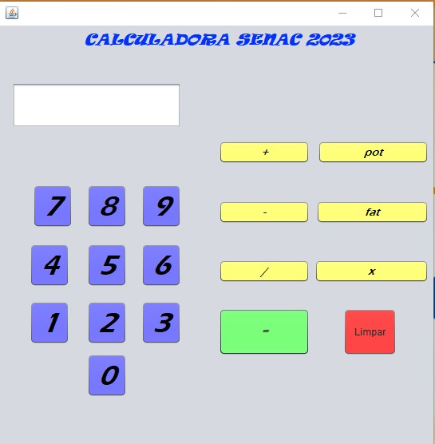
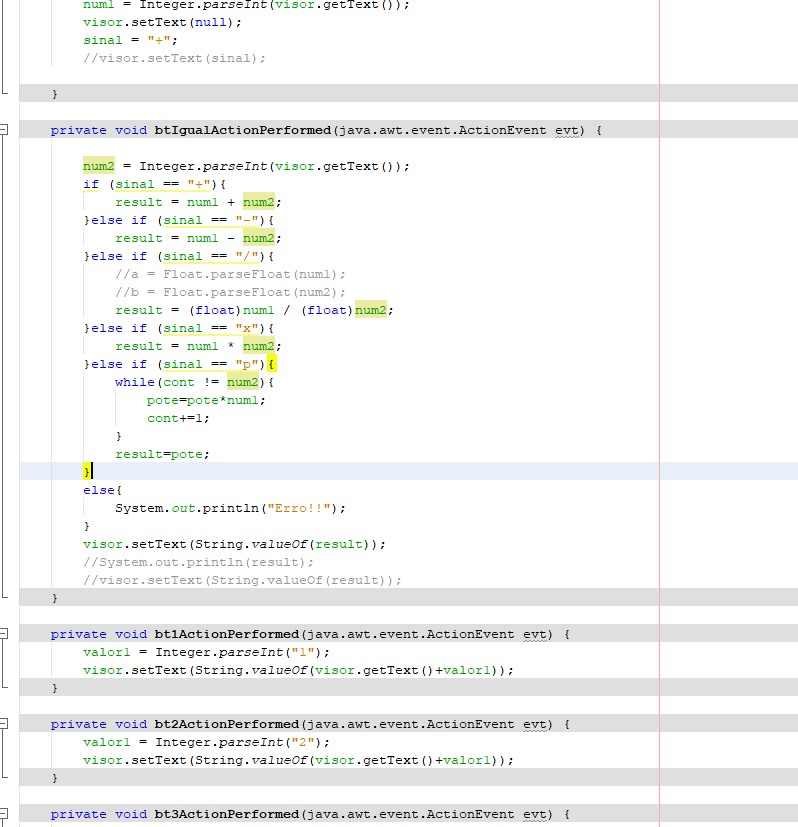

<h1>Calculadora-Java 🧮</h1>

<h2>Soma, Subtração, Divisão, Multiplicação, Fatorial e Potência feita em JAVA e JFrame</h2>

<h2>Explicação:</h2>

Calculadora com funções de Soma, Subtração, Divisão, Multiplicação, Fatorial e Potência. Feita na IDE NetBenas. Feita na linguagem Java. Aperte um número
a função que você quer depois outro numero e aperte o sinal de igual, depois que o resultado aparecer aperte o botão vermelho para limpar e use novamente.
Para fatorial aperte um numero e depois o botão de fatorial.

<h2>💻Tecnologias</h2>

- JAVA 

- JFrame 

- GIT e GitHub 

<h2>📱Contato</h2>

viktorariel777@gmail.com

